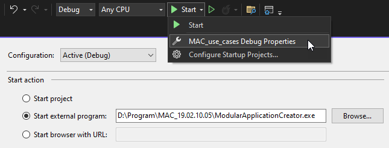
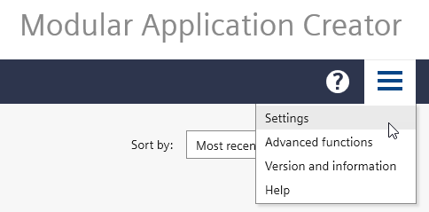
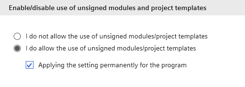
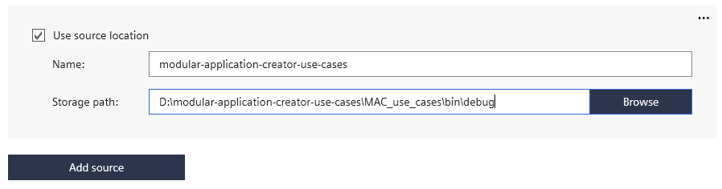

# Usecases for the SIMATIC Modular Application Creator **Module Builder**

This repository demonstrates how to use the comfort functions of the Modular Application Creator Module Builder. With those comfort functions the Openness programmer does not need to handle the xml file when e.g. calls in ladder logic should be generated. More information is available under [Modular Application Creator on SIOS](https://support.industry.siemens.com/cs/de/en/view/109762852).

## 🚀 Getting started Documentation

We just updated our [Modular Application Creator Use Case Based Documentation](https://siemens.github.io/modular-application-creator-use-cases/html/index.html).

## Prerequisites

- TIA-Portal installed on Windows PC
- Download the same major version of the [Modular Application Creator V19.2.10 or higher](https://support.industry.siemens.com/cs/de/en/view/109762852)
- Microsoft Visual Studio with Extension [Modular Application Creator Module Builder V19.2.10 or higher](https://support.industry.siemens.com/cs/de/en/view/109762852) installed

## Quickstart

Follow these steps to get started with the Modular Application Creator:

1. **Clone the Repository**:
   - Clone this repository into a local folder (avoid using a OneDrive folder).

2. **Set Up Debugging** (Optional):
   - Open your project in Visual Studio.
   - Go to `Properties` → `Debug` → `Start external program` and select `ModularApplicationCreator.exe`.

        

3. **Build & Run the Solution**:
   - Build the solution in Visual Studio and ensure it compiles successfully.
   - If there are missing packages, it may be due to incorrect or disabled NuGet sources provided by the [Modular Application Creator Module Builder](https://support.industry.siemens.com/cs/de/en/view/109762852). To resolve this:
     - Restart Visual Studio (this can fix rare issues).
     - Verify your NuGet sources by running the following command in the terminal:

       ```bash
       dotnet nuget list source
       ```

     - Ensure the **MacMbPackages** source is listed and enabled.
   - Once the solution builds successfully, start it in Visual Studio. The **Modular Application Creator** should launch.

4. **Configure the Modular Application Creator**:
    - Open the `Settings` tab in the top right corner

        

    - In the section `Enable/disable use of unsigned modules and project templates` allow the usage of unsigned modules/projects templates to be able to use this demo equipment module. If you like you can also apply this setting permanently

        

    - Click `Add Source` to add the source location to this Equipment Module / Project output NuGet package:

        

    - Go back to the `Main Page` -> `Create new project` -> `Select a Modular Application Creator project template from the list` -> Select the first DemoCase template -> `Create and open`
    - Assign the Equipment Module (`MAC_use_cases.xxx-prexxx`) to your PLC by dragging and dropping it.
    - Configure your module under the **Configure Modules** tab.
    - Click **Generate** under the **Generate** tab.

   > **Note**: Once completed, your TIA-Portal project will be generated.

## Contact us

If you have problems or suggestions, please send an email to [modular.application.creator.industry@siemens.com](mailto:modular.application.creator.industry@siemens.com)

## 📝 License

Copyright © 2025 [Siemens AG](https://www.siemens.com/).

This project is MIT licensed.
