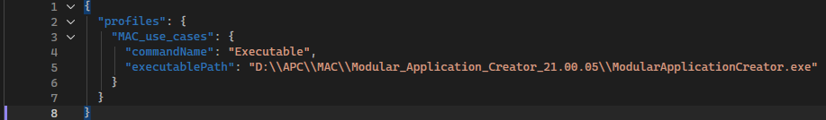
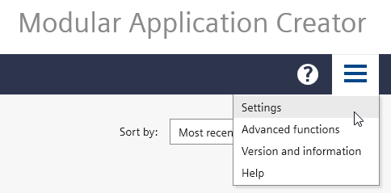
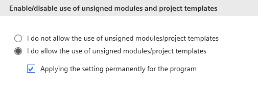
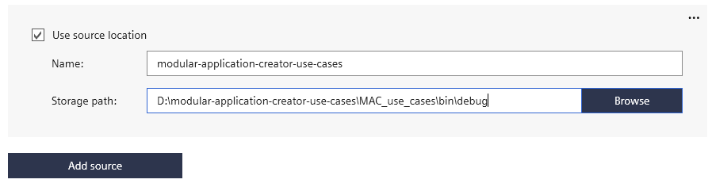

# Usecases for the SIMATIC Modular Application Creator **Module Builder**

This repository demonstrates how to use the comfort functions of the Modular Application Creator Module Builder. With those comfort functions the Openness programmer does not need to handle the xml file when e.g. calls in ladder logic should be generated. More information is available under [Modular Application Creator on SIOS](https://support.industry.siemens.com/cs/de/en/view/109762852).

## 🚀 Getting started Documentation

We just updated our [Modular Application Creator Use Case Based Documentation](https://siemens.github.io/modular-application-creator-use-cases/html/index.html).

## Prerequisites

- TIA-Portal installed on Windows PC
- TIA-Portal Editing language and Reference language set to English (United States)
- Download the same major version of the [Modular Application Creator V21.0.5 or higher](https://support.industry.siemens.com/cs/de/en/view/109762852)
- Microsoft Visual Studio with Extension [Modular Application Creator Module Builder V21.0.5 or higher](https://support.industry.siemens.com/cs/de/en/view/109762852) installed

## Quickstart

Follow these steps to get started with the Modular Application Creator:

1. **Clone the Repository**:
   - Clone this repository into a local folder (avoid using a OneDrive folder).

2. **Set Up Debugging** (Optional):
   - Open your project in Visual Studio.
   - Open launchSettings.json in MAC_use_cases project
   - Adapt the executablePath according to the location of your ModularApplicationCreator.exe

        

3. **Build & Run the Solution**:
   - Build the solution in Visual Studio and ensure it compiles successfully.
   - If there are missing packages, it may be due to incorrect or disabled NuGet sources provided by the [Modular Application Creator Module Builder](https://support.industry.siemens.com/cs/de/en/view/109762852). To resolve this:
     - Restart Visual Studio (this can fix rare issues).
     - Verify your NuGet sources by running the following command in the terminal:

       ```bash
       dotnet nuget list source
       ```

     - Ensure the **MacMbPackages** source is listed and enabled.
   - Once the solution builds successfully, start it in Visual Studio. The **Modular Application Creator** should launch.

4. **Configure the Modular Application Creator**:
    - Open the `Settings` tab in the top right corner

        

    - In the section `Enable/disable use of unsigned modules and project templates` allow the usage of unsigned modules/projects templates to be able to use this demo equipment module. If you like you can also apply this setting permanently

        

    - Click `Add Source` to add the source location to this Equipment Module / Project output NuGet package:

        

    - Go back to the `Main Page` -> `Create new project` -> `Select a Modular Application Creator project template from the list` -> Select the first DemoCase template -> `Create and open`
    - Assign the Equipment Module (`MAC_use_cases.xxx-prexxx`) to your PLC by dragging and dropping it.
    - Configure your module under the **Configure Modules** tab.
    - Click **Generate** under the **Generate** tab.

   > **Note**: Once completed, your TIA-Portal project will be generated.

## Triggering Generation from a 3rd Party Application (CLI)

The **Modular Application Creator CLI** lets you automate project creation, module installation and configuration without opening the GUI.

### 1. Create a new project

Creates a new MAC project from a template and saves it to a specified path. It is located next to the ModularApplicatoinCreator.exe file.

#### Command structure
```bash
<PATH_TO_CLI>\ModularApplicationCreatorCLI.exe createProject "<TEMPLATE_NAME>:<TEMPLATE_VERSION>" "<PATH_TO_MAC_PROJECT>"
```
#### Placeholders

| Placeholder | Description | Example |
|---|---|---|
| `<PATH_TO_CLI>` | Directory containing `ModularApplicationCreatorCLI.exe` | `C:\Program Files\Siemens\MAC` |
| `<TEMPLATE_NAME>` | Name of the project template | `DemoCase_S71500_S210_GSD_ET200SP` |
| `<TEMPLATE_VERSION>` | Version of the template | `21.0.5` |
| `<PATH_TO_MAC_PROJECT>` | Full path where the `.project` file will be saved | `C:\Projects\MyProject\ModularApplicationCreator.project` |

#### Full example
```bash
C:\Program Files\Siemens\MAC\ModularApplicationCreatorCLI.exe createProject "DemoCase_S71500_S210_GSD_ET200SP:21.0.5" "C:\Projects\MyProject\ModularApplicationCreator.project"
```

### 2. Load, install and configure a module

Loads an existing MAC project, installs a module on a device and applies a JSON configuration file.

#### Command structure
```bash
<PATH_TO_CLI>\ModularApplicationCreatorCLI.exe loadProject      "<PATH_TO_MAC_PROJECT>" installModules   "<DEVICE_NAME>:MAC_use_cases:<MODULE_INSTANCE_NAME>" ` configureModules "<DEVICE_NAME>:<MODULE_INSTANCE_NAME>:<PATH_TO_CONFIG_JSON>" generate
```

#### Placeholders

| Placeholder | Description | Example |
|---|---|---|
| `<PATH_TO_CLI>` | Directory containing `ModularApplicationCreatorCLI.exe` | `C:\Program Files\Siemens\MAC` |
| `<PATH_TO_MAC_PROJECT>` | Full path to the `.project` file | `C:\Projects\MyProject\ModularApplicationCreator.project` |
| `<DEVICE_NAME>` | PLC device name in the MAC project | `PLC_1` |
| `<MODULE_INSTANCE_NAME>` | Module instance name assigned to the device | `Mac_use_cases` |
| `<PATH_TO_CONFIG_JSON>` | Full path to the JSON config file from the **Export** button | `C:\Config\MAC_use_cases.json` |

#### Full example
```bash
C:\Program Files\Siemens\MAC\ModularApplicationCreatorCLI.exe loadProject "C:\Projects\MyProject\ModularApplicationCreator.project" installModules   "PLC_1:MAC_use_cases:Mac_use_cases" configureModules "PLC_1:Mac_use_cases:C:\Config\MAC_use_cases.json" generate
```

> **Tip**: Use the **Export** button on the *First Page* of the module UI to generate the `<PATH_TO_CONFIG_JSON>` file. Also a already exported config Json is located in CLI_Example\ModulConfig\MAC_use_cases.json
## Contact us

If you have problems or suggestions, please send an email to [modular.application.creator.industry@siemens.com](mailto:modular.application.creator.industry@siemens.com)

## 📝 License

Copyright © 2025 [Siemens AG](https://www.siemens.com/).

This project is MIT licensed.
