# Overview

## Quick Navigation

1. [Use Cases](namespace_m_a_c__use__cases_1_1_model_1_1_use_cases.html)
    1. [Create Variables](class_m_a_c__use__cases_1_1_model_1_1_use_cases_1_1_create_variables.html)
    2. [General Support](class_m_a_c__use__cases_1_1_model_1_1_use_cases_1_1_general_support.html)
    3. [Generic Block Generation](class_m_a_c__use__cases_1_1_model_1_1_use_cases_1_1_generic_block_creation.html)
    4. [Hardware Generation](class_m_a_c__use__cases_1_1_model_1_1_use_cases_1_1_hardware_generation.html)
    5. [Hardware Generation Excel Based](class_m_a_c__use__cases_1_1_model_1_1_use_cases_1_1_hardware_generation_excel_based.html)
    6. [Use Integrated Libraries](class_m_a_c__use__cases_1_1_model_1_1_use_cases_1_1_integrate_libraries.html)
    7. [Model Serialization](class_m_a_c__use__cases_1_1_model_1_1_use_cases_1_1_model_to_serialize.html)
    8. [Non Tia Portal Bases Operations](class_m_a_c__use__cases_1_1_model_1_1_use_cases_1_1_non_t_i_a_project_based.html)
    9. [Technology Object Handling](class_m_a_c__use__cases_1_1_model_1_1_use_cases_1_1_technology_object_class.html)
    10. [Software Units](class_m_a_c__use__cases_1_1_model_1_1_use_cases_1_1_software_units.html)
2. [How to integrate libraries](@ref section-id)
3. [How to use different lanugages](@ref localization-id)
4. [How to upgrade a v20 module to v21](@ref module-upgrade-id)
5. [Help for this documentation](@ref help-id)

## How to integrate libraries {#section-id}

With the help of the .tiares file, libraries can be easily integrated in the Module Builder. To do this, the file must first be opened in Visual Studio.

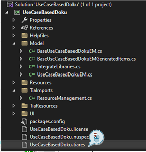

In the newly opened window, the selection menu can now be opened using the button in the top left-hand corner.
The desired library must then be selected there.

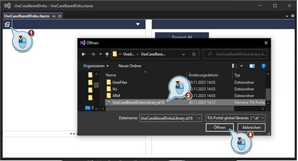

By clicking on the "Mastercopies" area and then pressing the "Add" button, everything is included. This window can then be closed again, as everything is saved automatically.

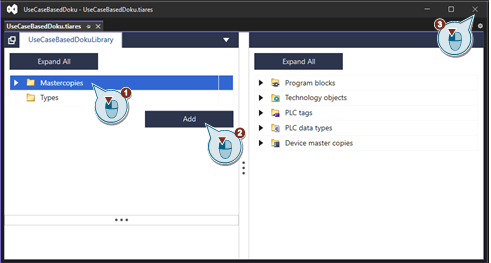

To integrate parts of the library use the code explainned in [Use Integrated Libraries](class_m_a_c__use__cases_1_1_model_1_1_use_cases_1_1_integrate_libraries.html)

## How to use different lanugages {#localization-id}

Currently the Modular Application Creator supports following languages:

- en - English
- de - German
- zh - Chinese

The language can be changed during runtime in the settings menu. Depending on the selected language one of the defined XAML ResourceDictionary will be used.

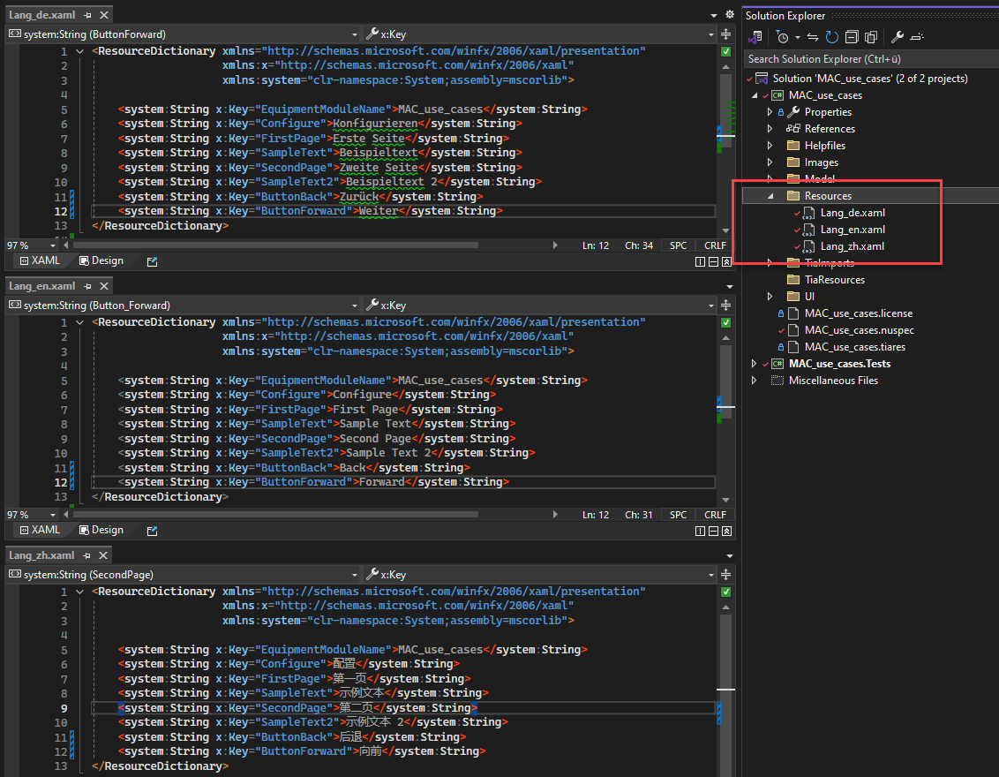

Create KeyValue pairs in the ResourceDictionaries with matching Key and use them with DynamicResource Binding in your XAML files:

```xaml
        <TextBlock Text="{DynamicResource SampleText}" />
```

## How to upgrade a v20 module to v21 {#module-upgrade-id}

There have been major changes in the new TIA Portal V21 Openness API. This API **is not backward compatible** with any previous APIs, therefore every Openness user **must upgrade** their project to the latest API. To do this task with Siemens Modular Application Creator Equipment Modules, this manual will make it easier.

There are two easy ways to do it, if you already have the **Siemens Collaboration Framework** installed in your project, or if you don’t have it installed yet but agree to install it. This framework comes with MAC-MB by default and can only be missing in case of (un)intended removal, or in a case of a very old EQM project.

The third, bit harder way to do it is to direct reference the new dll-s into the csproj.

### How does it work if the EQM is not upgraded?

If you install the module to MAC V21 and generate, this is the result:

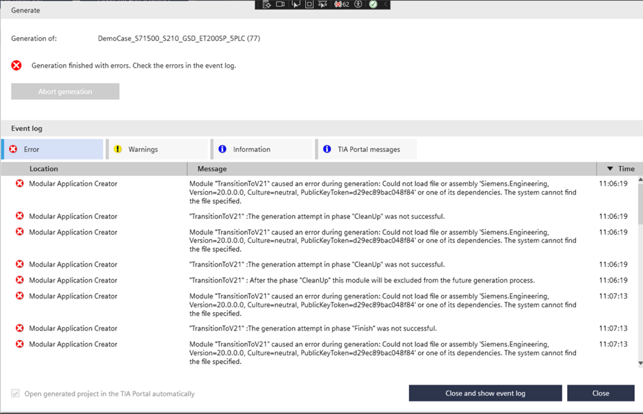

The v20 Siemens.Engineering.dll is not compatible with v21 dll-s, and also it does not exist in v21 installs, so MAC throws an assemby load exception. (This is expected behavior in this case).

#### **Fix 1** - If you already have collaboration framework installed on your project.

If your project has collaboration framework then the changeover can be very easy.

1.	Install the latest v21 MAC-MB
2.	In your EQM project, select „Manage NuGet Packages”
3.	Select the package source: „MacMbPackages”

    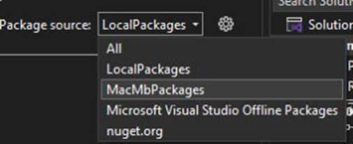
4.	Update all of these packages to the latest. 

    <span style="color:red">**If you have “EquipmentModule.Build.Tasks” package, the update will not be an option because of the rename of this package. Please uninstall it and install “Siemens.EquipmentModule.Build.Tasks” latest version from this repo.**</span>
    
    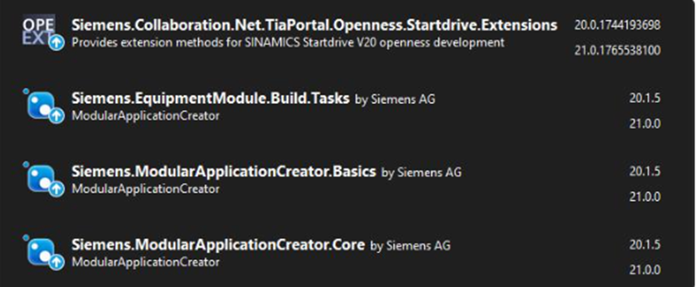
5.	Rebuild your project
6.	If the build fails, please proceed to fix incompatibilities with the Openness V21 API until every error is resolved. 
Some useful links:
https://asrdwiki.siemens.com/tiapdev/index.php/Openness/How_to_handle_cross_dependencies_of_EOM_with_Segmented_Engineering_Assemblies
https://asrdwiki.siemens.com/tiapdev/index.php/Openness/How_to_Generate_Openness_Segmented_Assemblies
https://asrdwiki.siemens.com/tiapdev/index.php/Openness/How_to_Use_Openness_Segmented_Assemblies_in_Tests
7.	Try to generate your module with MAC V21. It should work now.

    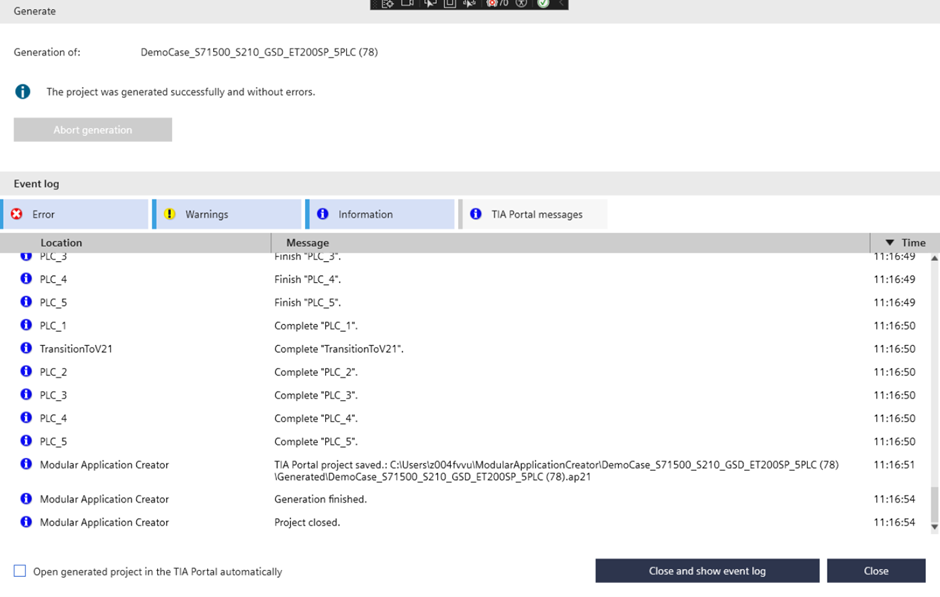
8.	If the generation fails, please go back to point #6.
9.	(Optional) There might be an old API dll stored in your EQM project. You can either change this dll to the V21 engineering dll-s, or you can delete it if your project does not use it. It does not matter at runtime.

    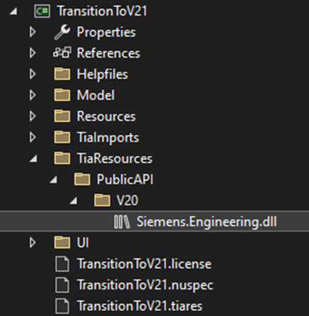

#### **Fix 2** - If you do not have the Collaboration Framework installed on your project

If you do not have a nuget package reference for the Collaboration Framework, your module might use a direct dll reference to Siemens.Engineering.dll. The easiest way to fix this is to remove the dll reference and install the Collaboration Framework.
1.	Remove all references for Siemens.Engineering.dll from your project.
2.	Install the latest v21 MAC-MB
3.	In your EQM project, select „Manage NuGet Packages”
4.	Select the package source: „MacMbPackages”

    
5.	On the “Browse” tab, find and install “Siemens.Collaboration.Net.TiaPortal.Openness.Startdrive.Extensions”. The other packages will be installed as dependencies automatically.

    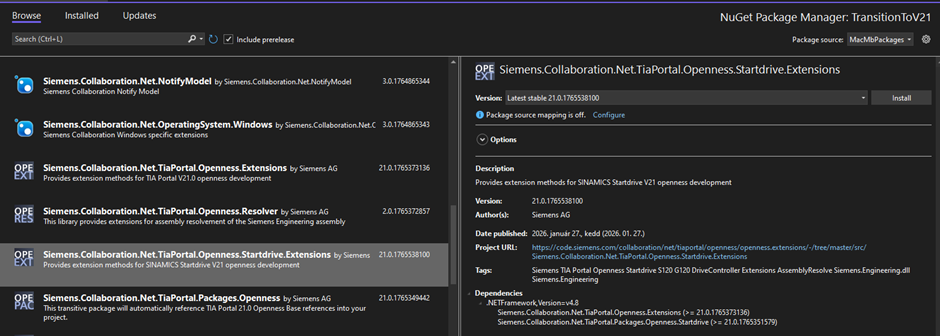
6.	Please Follow **Fix 1** from point **#4** – Update the NuGet packages.

#### **Fix 3** - If your project has direct dll references and is not planned to change it for the Collaboration framework

1.	Locate your TIA Portal install path, and find the API dll-s. 
(Usually: C:\Program Files\Siemens\Automation\Portal 21\PublicAPI\V21\net48).
2.	Select the non “AddIn” – dll-s. 

    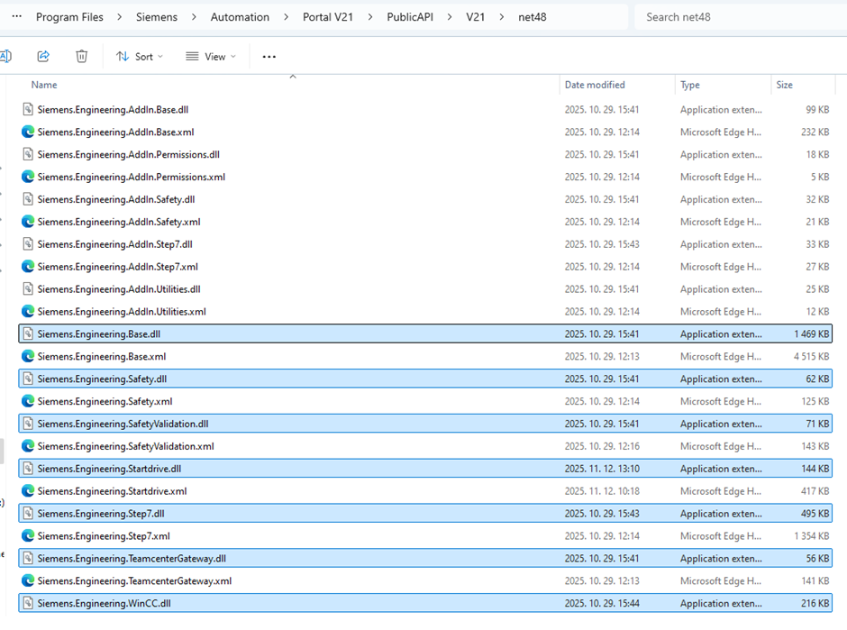
3.	Add these dll-s into your project so the references will not be computer specific.

    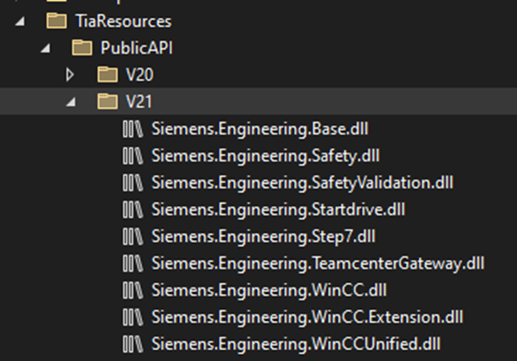
4.	Make a dll reference for all 9 of them.

    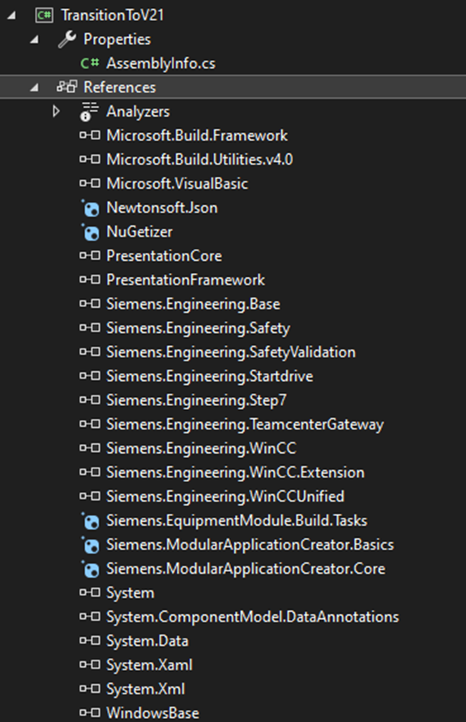
5.	Please Follow **Fix 1** from point **#4** – Update the NuGet packages. **At this point you will not have to update the Collaboration package as your project does not have it.**

## Help for this documentation {#help-id}

### Classes

The "Classes" section explains the classes used in the project.
In addition to the explanation of the class and a first overview of all functions used in the class, the page contains a detailed explanation of all functions of the class.


In all explanatory sections there is a short literal explanation of the function and its parameters, as well as a picture of the resulting result in the Tia Portal after generation.
Also included is the used code of the function and a link to the code of the whole class.


### Files

The above-mentioned link to the class code then points to the files contained in the "Files" section.
There, all classes in the C# code are included again to show how the classes look as simple as possible.
It is also possible to copy the code to reuse it in your own modules.


